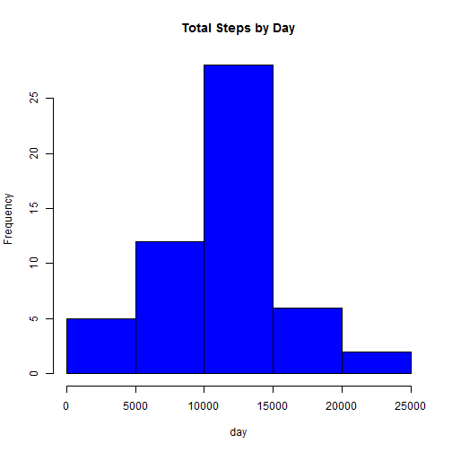
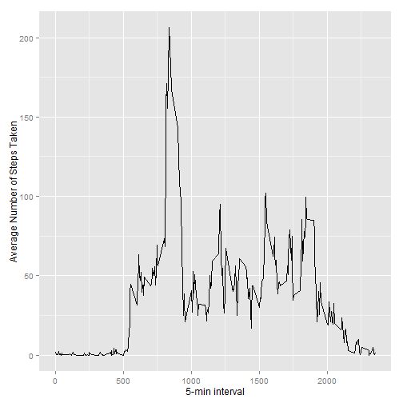
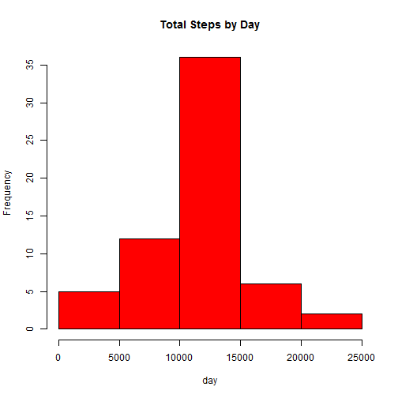
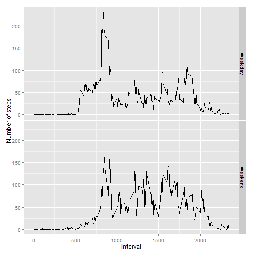

Reproducible Research: Peer Assessment 1
========================================================

Introduction
--------------------------

It is now possible to collect a large amount of data about personal movement using activity monitoring devices such as a Fitbit, Nike Fuelband, or Jawbone Up. These type of devices are part of the "quantified self" movement -- a group of enthusiasts who take measurements about themselves regularly to improve their health, to find patterns in their behavior, or because they are tech geeks. But these data remain under-utilized both because the raw data are hard to obtain and there is a lack of statistical methods and software for processing and interpreting the data.

This assignment makes use of data from a personal activity monitoring device. This device collects data at 5 minute intervals through out the day. The data consists of two months of data from an anonymous individual collected during the months of October and November, 2012 and include the number of steps taken in 5 minute intervals each day.

Data
-----------------

The data for this assignment can be downloaded from the course web site:

- Dataset: Activity monitoring data [52K]

The variables included in this dataset are:
 
- steps: Number of steps taking in a 5-minute interval (missing values are coded as NA)

- date: The date on which the measurement was taken in YYYY-MM-DD format

- interval: Identifier for the 5-minute interval in which measurement was taken

The dataset is stored in a comma-separated-value (CSV) file and there are a total of 17,568 observations in this dataset.

Assignment
-------------------------------

This assignment will be described in multiple parts. You will need to write a report that answers the questions detailed below. Ultimately, you will need to complete the entire assignment in a single R markdown document that can be processed by knitr and be transformed into an HTML file.

Throughout your report make sure you always include the code that you used to generate the output you present. When writing code chunks in the R markdown document, always use echo = TRUE so that someone else will be able to read the code. This assignment will be evaluated via peer assessment so it is essential that your peer evaluators be able to review the code for your analysis.

For the plotting aspects of this assignment, feel free to use any plotting system in R (i.e., base, lattice, ggplot2)

Fork/clone the GitHub repository created for this assignment. You will submit this assignment by pushing your completed files into your forked repository on GitHub. The assignment submission will consist of the URL to your GitHub repository and the SHA-1 commit ID for your repository state.
Load and preprocessing the data
--------------------------------------------------------


```r
url="https://d396qusza40orc.cloudfront.net/repdata%2Fdata%2Factivity.zip"
download.file(url, destfile = "activity.zip" )
```

```
## Error in download.file(url, destfile = "activity.zip"): unsupported URL scheme
```

```r
unzip(zipfile="activity.zip")
activity<-read.csv("activity.csv",colClasses=c("numeric","character","numeric"))
activity$date<-as.Date(activity$date,"%Y-%m-%d")
head(activity)
```

```
##   steps       date interval
## 1    NA 2012-10-01        0
## 2    NA 2012-10-01        5
## 3    NA 2012-10-01       10
## 4    NA 2012-10-01       15
## 5    NA 2012-10-01       20
## 6    NA 2012-10-01       25
```


What is mean total number of steps taken per day?
--------------------------------------------------------

```r
library(ggplot2)
```

```
## Warning: package 'ggplot2' was built under R version 3.1.1
```

```r
Tot_Steps<-aggregate(steps~date,data=activity,sum,na.rm=TRUE)

#Make a histogram of the total number of steps taken each day
hist(Tot_Steps$steps,main="Total Steps by Day",xlab="day",col="blue")
```

 

```r
#Calculate and report the mean and median total number of steps taken per day
mean(Tot_Steps$steps,na.rm=TRUE)
```

```
## [1] 10766.19
```

```r
median(Tot_Steps$steps,na.rm=TRUE)
```

```
## [1] 10765
```

What is the average daily activity pattern?
--------------------------------------------------------

```r
avg_daily_patt<-aggregate(steps~interval,data=activity,mean,na.rm=TRUE)

#Make a time series plot (i.e. type = "l") of the 5-minute interval (x-axis) and the average number of steps taken, averaged across all days (y-axis)
ggplot(data=avg_daily_patt,aes(x=interval,y=steps))+geom_line()+xlab("5-min interval")+ylab("Average Number of Steps Taken")
```

 

```r
#Which 5-minute interval, on average across all the days in the dataset, contains the maximum number of steps?
avg_daily_patt[which.max(avg_daily_patt$steps),1]
```

```
## [1] 835
```
Imputing missing values
--------------------------------------------------------


```r
#Calculate and report the total number of missing values in the dataset (i.e. the total number of rows with NAs)

NA.total=sum(is.na(activity))
NA.total
```

```
## [1] 2304
```

```r
#Devise a strategy for filling in all of the missing values in the dataset. The strategy does not need to be sophisticated. For example, you could use the mean/median for that day, or the mean for that 5-minute interval, etc.

#NA in the given interval replaced by mean in the 5-min interval

for (i in 1:nrow(activity)){
  if (is.na(activity$steps[i])){
    activity$steps[i]=subset(avg_daily_patt,interval==activity$interval[i])$steps
  }
}

Tot_Steps<-aggregate(steps~date,data=activity,sum,na.rm=TRUE)

#Make a histogram of the total number of steps taken each day
hist(Tot_Steps$steps,main="Total Steps by Day",xlab="day",col="red")
```

 

```r
#Calculate and report the mean and median total number of steps taken per day
mean(Tot_Steps$steps,na.rm=TRUE)
```

```
## [1] 10766.19
```

```r
median(Tot_Steps$steps,na.rm=TRUE)
```

```
## [1] 10766.19
```
Do these values differ from the estimates from the first part of the assignment? What is the impact of imputing missing data on the estimates of the total daily number of steps?

Answer: Only the median differs from the estimates from the first part of the assignment. Filling in missing data from mean does not affect the mean, however, moves the median closer to mean.

Are there differences in activity patterns between weekdays and weekends?
--------------------------------------------------------


```r
day<-weekdays(activity$date)
activity$level="Weekday"

for (i in 1:nrow(activity)){
  if (day[i] == "Saturday"|day[i]=="Sunday"){
    activity$level[i]="Weekend"
    }
  }

activity$level=factor(activity$level)
Tot_Steps_level<-aggregate(steps~interval+level,data=activity,mean)
```

Make a panel plot containing a time series plot (i.e. type = "l") of the 5-minute interval (x-axis) and the average number of steps taken, averaged across all weekday days or weekend days (y-axis). See the README file in the GitHub repository to see an example of what this plot should look like using simulated data.


```r
ggplot(Tot_Steps_level,aes(x=interval,y=steps,fill=level))+geom_line()+facet_grid(level~.) + xlab("Interval")+ylab("Number of steps")
```

 
